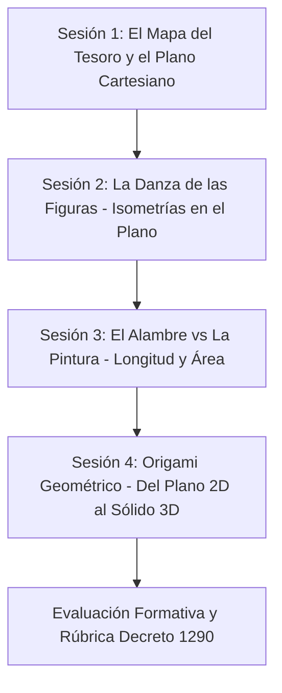

# 🇨🇴 Guía Pedagógica y Plan de Aula para el Docente
## Geometría y Medición - Grado 6° de Educación Básica Secundaria
**Título de la Unidad:** *Exploradores del Espacio y la Medida: De las Formas 2D a los Cuerpos 3D*  
**Herramientas:** Cuaderno Interactivo Quarto (`.qmd`), Jupyter Notebook (`.ipynb`) y Animaciones Matemáticas con Manim.

---

## 1. Identificación y Referentes Curriculares (MEN Colombia)

| Elemento Curricular | Descripción / Formulación Oficial |
|---|---|
| **Área / Asignatura** | Matemáticas / Geometría y Sistemas Métricos |
| **Grado / Ciclo** | Grado 6° / Básica Secundaria (11 - 12 años) |
| **Intensidad Horaria Sugerida** | 4 sesiones de 50-60 minutos (o 2 bloques de 2 horas) |
| **Pensamientos Matemáticos** | **Pensamiento Espacial y Sistemas Geométricos** + **Pensamiento Métrico y Sistemas de Medidas** |
| **Competencia 1 (MEN)** | *Reconoce las características medibles y de posición de objetos bidimensionales y de movimientos simples de estos: rotación, traslación y reflexión.* |
| **Evidencia 1.1** | *Señala los atributos medibles de una figura junto con sus posibles unidades y magnitudes.* |
| **Competencia 2 (MEN)** | *Reconoce características de objetos geométricos y métricos.* |
| **Evidencia 2.1** | *Identifico relaciones entre figuras bidimensionales y tridimensionales.* |
| **Evidencia 2.2** | *Utilizo sistemas de referencia para representar la ubicación de objetos geométricos.* |
| **Evidencia 2.3** | *Reconozco el conjunto de unidades usadas para cada magnitud: longitud y área.* |
| **DBA Asociados (Grado 6°)** | **DBA 5:** Propone y desarrolla estrategias de estimación y cálculo de magnitudes (perímetro y área).<br>**DBA 6:** Representa y construye figuras bidimensionales y objetos tridimensionales a partir del análisis de sus propiedades y transformaciones. |

---

## 2. Estructura Didáctica por Sesiones de Clase



---

### 📍 Sesión 1: El Mapa del Tesoro y el Plano Cartesiano (50 min)
* **Objetivo de la sesión:** Dominar la ubicación, lectura y trazado de puntos y polígonos mediante pares ordenados $(x, y)$ en los cuatro cuadrantes.
* **Momento 1 - Exploración (10 min):**
  - Pregunta provocadora: *¿Cómo sabe la aplicación de Waze o el mapa de un videojuego en qué calle exacta nos encontramos?*
  - Introducción al concepto de coordenadas y puntos de referencia.
* **Momento 2 - Estructuración (20 min):**
  - Proyección de la Escena Manim 1: `PlanoCartesianoYPosicion`.
  - Análisis guiado: ¿Por qué el orden importa en $(x, y)$? (Diferenciar $(2, 3)$ de $(3, 2)$).
  - Trazado de líneas de proyección y formación del polígono de 4 vértices.
* **Momento 3 - Práctica y Transferencia (15 min):**
  - Resolver el **Micro-Reto 1** del cuaderno: el barco pesquero y la ubicación del faro.
  - Actividad en parejas: Dibujar un triángulo en el plano y dictarle las coordenadas al compañero para que lo reproduzca a ciegas.
* **Momento 4 - Cierre y Valoración (5 min):**
  - Pregunta de salida (*Ticket de salida*): Si un punto tiene $x < 0$ e $y < 0$, ¿en qué cuadrante está? ($(-,-) \rightarrow$ Cuadrante III).

---

### 🔄 Sesión 2: La Danza de las Figuras - Movimientos Rígidos (50 min)
* **Objetivo de la sesión:** Reconocer y aplicar traslaciones, rotaciones y reflexiones preservando la congruencia y dimensiones de la figura.
* **Momento 1 - Exploración (10 min):**
  - Observar fotografías de pisos coloniales de Villa de Leyva o Cartagena y artesanías precolombinas (motivos Zenú/Muisca).
  - Pregunta: *¿Cómo se crea un patrón repetitivo sin cambiar el tamaño de la figura original?*
* **Momento 2 - Estructuración (20 min):**
  - Proyección de la Escena Manim 2: `TransformacionesIsometricas`.
  - Pausar en cada una de las 3 fases:
    1. **Traslación:** Mostrar la flecha del vector $\vec{v} = (+3, +1)$.
    2. **Rotación:** Observar el punto pivote $O(0,0)$ y el sentido antihorario ($+90^\circ$).
    3. **Reflexión:** Notar que los puntos homólogos están a igual distancia del eje espejo perpendicular.
* **Momento 3 - Práctica y Transferencia (15 min):**
  - Resolver el **Micro-Reto 2** del cuaderno.
  - Ejercicio en el cuaderno: Dibujar la letra "F" y aplicarle una reflexión respecto a una línea vertical. Discutir qué le ocurre a la orientación.
* **Momento 4 - Cierre (5 min):**
  - Conclusión grupal: *¿Por qué se llaman movimientos "rígidos"?* (Porque no estiran ni encogen la figura).

---

### 📏 Sesión 3: El Alambre vs La Pintura - Longitud (1D) y Área (2D) (50 min)
* **Objetivo de la sesión:** Diferenciar conceptualmente las magnitudes de longitud y área, asignando unidades lineales ($m, cm$) y cuadradas ($m^2, cm^2$) respectivamente.
* **Momento 1 - Exploración (10 min):**
  - El dilema del maestro de obra: *Tenemos una tabla de madera de $4\text{ m} \times 3\text{ m}$. Si queremos ponerle un marco de caucho en los bordes y pintarla con barniz por encima, ¿usamos el mismo tipo de medida?*
* **Momento 2 - Estructuración (20 min):**
  - Proyección de la Escena Manim 3: `LongitudVsArea`.
  - Visualización del **desenrollado del contorno** en una sola línea recta de $14\text{ m}$ ($1\text{D}$).
  - Visualización del **llenado con 12 cuadrículas unitarias de $1\text{ m} \times 1\text{ m} = 1\text{ m}^2$** ($2\text{D}$).
  - Discusión sobre por qué sumar $5\text{ m} + 15\text{ m}^2$ es una aberración matemática.
* **Momento 3 - Práctica y Transferencia (15 min):**
  - Resolver el **Reto 3 del Taller Práctico**: La remodelación de la cancha de microfútbol ($28\text{ m} \times 15\text{ m}$).
  - Cálculo de metros lineales de cinta vs galones de pintura.
* **Momento 4 - Cierre (5 min):**
  - Tablero de síntesis con las unidades del Sistema Internacional ($mm, cm, m, km$ vs $mm^2, cm^2, m^2, km^2$).

---

### 📦 Sesión 4: Origami Geométrico - Del Plano 2D al Sólido 3D (50 min)
* **Objetivo de la sesión:** Identificar las relaciones de transformación entre redes planas bidimensionales y cuerpos tridimensionales.
* **Momento 1 - Exploración (10 min):**
  - Entregar a los estudiantes una caja de cartón desarmada (de medicamentos o alimentos).
  - Pregunta: *¿Cómo una hoja de cartón plana se convierte en un recipiente que puede contener volumen?*
* **Momento 2 - Estructuración (20 min):**
  - Proyección de la Escena Manim 4: `De2Da3DDesdoblamiento`.
  - Análisis del plegado de las 6 caras cuadradas hacia el cubo 3D y rotación de la cámara.
  - Formalización de los elementos: Caras ($2\text{D}$), Aristas ($1\text{D}$) y Vértices ($0\text{D}$).
  - Introducción a la relación de Euler: $C + V - A = 2$.
* **Momento 3 - Práctica y Transferencia (15 min):**
  - Resolver el **Reto 2 del Taller**: El empaque de café con forma de prisma triangular.
  - Construcción manual o dibujo del desarrollo plano de una pirámide de base cuadrada.
* **Momento 4 - Cierre y Evaluación (5 min):**
  - Aplicación de las preguntas de selección múltiple tipo ICFES Saber 6°.

---

## 3. Errores Conceptuales Frecuentes y Cómo Abordarlos

| Error Común en Grado 6° | Causa Cognitiva | Estrategia de Mediación con Manim |
|---|---|---|
| **Inversión de coordenadas $(y, x)$** | Los estudiantes confunden el eje horizontal con el vertical. | Resaltar en la animación que la primera coordenada siempre camina por el "suelo" ($X$) y la segunda sube o baja en el "ascensor" ($Y$). |
| **Confusión de Perímetro y Área** | Memorización mecánica de fórmulas sin comprensión espacial. | Usar la animación de desenrollar el contorno (cuerda) vs colocar baldosas cuadradas en el piso. |
| **Sumar unidades heterogéneas ($m + m^2$)** | Falta de análisis dimensional. | Analogía física: No se puede sumar la longitud de una cerca con la cantidad de pintura de una pared. |
| **Dificultad para visualizar el sólido desde la red plana** | Dificultad en la rotación mental espacial. | Pausar la animación 3D de Manim y girar el cubo en diferentes ángulos para mostrar caras opuestas. |

---

## 4. Opciones de Uso Tecnológico para el Docente

### Opción A: Proyección en el Navegador con Quarto
Para generar la página web interactiva con estilo profesional:
```bash
quarto render clase_geometria_grado6.qmd --to html
```
Abre el archivo `clase_geometria_grado6.html` en cualquier navegador web (Chrome, Firefox, Edge).

### Opción B: Ejecución en Google Colab con 1 Clic
1. Sube el archivo `clase_geometria_grado6.ipynb` a [colab.research.google.com](https://colab.research.google.com).
2. Ejecuta la primera celda con `%pip install manim`.
3. Ejecuta cada celda `%%manim` para reproducir las animaciones interactivas directamente frente a los estudiantes.

### Opción C: Renderizado de Videos MP4 para Aulas sin Internet (Offline)
Para generar los archivos de video `.mp4` y guardarlos en una memoria USB:
```bash
python3 generar_videos.py
```
Los videos quedarán listos en resolución optimizada para proyector o televisor escolar.
